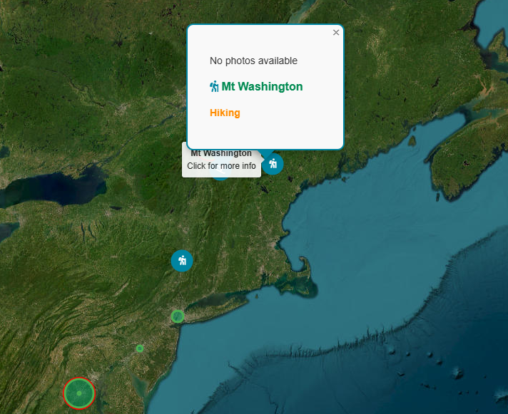
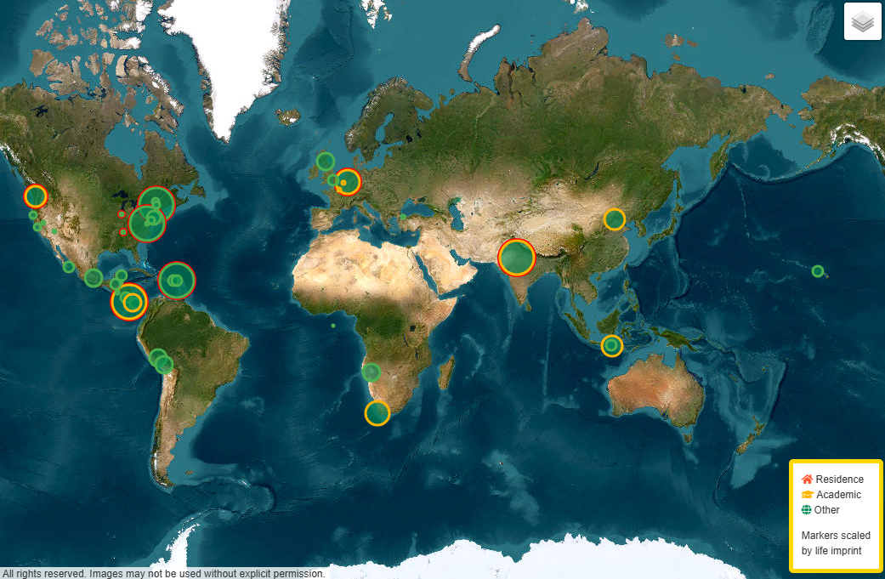
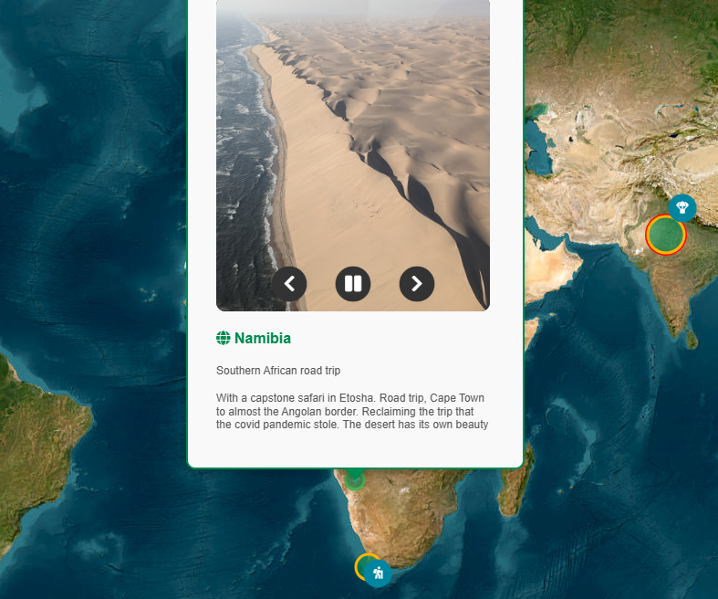
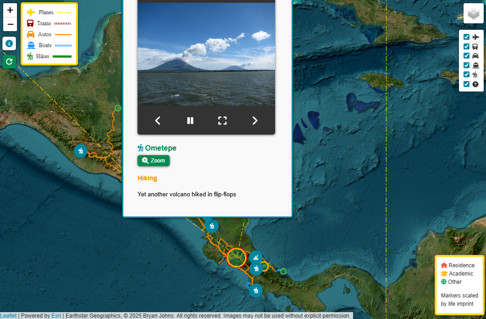
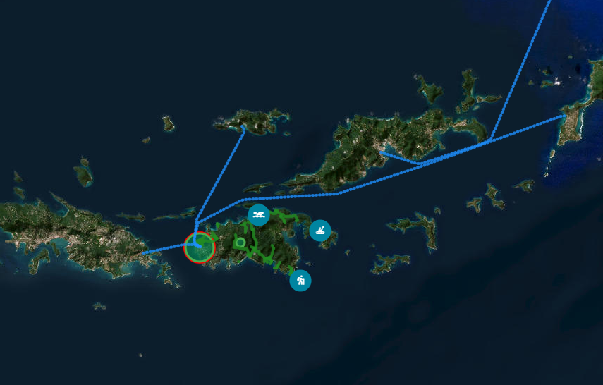

# Waypoints: A GeoBiography
 

*Mapping memories: An interactive travelogue handcrafted with Leaflet.js, Python, and open-source geospatial resources.*

🌍 [Live Site](https://johbry17.github.io/Waypoints-A-GeoBiography/)

> ⚠️ This project is under active development.

## Table of Contents

- [Project Overview](#project-overview)
- [Features](#features)
- [Tools & Technologies](#tools--technologies)
- [Usage](#usage)
- [Gallery](#gallery)
- [References](#references)
- [Licenses](#licenses)
- [Acknowledgements](#acknowledgements)
- [Author](#author)

## Project Overview

**Waypoints: A GeoBiography** is a map-based storytelling project—an interactive memoir composed of travels, memories, and photos. What began as a simple way to pin photos on a map, so I can bore others with my vacation photos, soon evolved into a full-stack geospatial app integrating **Leaflet.js**, **Python**, and a suite of open mapping APIs.

It’s a digital keepsake, visualized through:
- 📍 Custom markers with photo carousels
- 🥾 Activity overlays (e.g., hiking, snorkeling, kayaking)
- 🛫 Route mapping for planes, boats, trains, and more

At its core is a flexible geospatial engine powered by GeoJSON and open-source APIs like **Overpass**, **OpenRouteService**, and **Nominatim**, with data managed via Google Sheets. [View Data Dictionary](data_dictionary.md).

## Features

- 🗺️ **Interactive Leaflet Map** with zoomable, pan-able layers
- 🖼️ **Photo Carousels** in location popups
- 🎯 **Activity Icons & Overlays** (hiking, snorkeling, sightseeing, etc.)
- 🛣️ **Transportation Routes** for air, road, rail, boat, and foot
- 📍 **Custom Marker Clustering** for performance and clarity
- 🌐 **Multi-source Geospatial Data Integration** (OSM, APIs, hand-drawn)
- 👣 **Interactive Guided Tour** walking users through map layers, markers, and controls
- 📱 **Responsive UI** for desktop and mobile

## Tools & Technologies

- **Frontend**: Leaflet.js, Shepherd.js, HTML, CSS, JavaScript
- **Backend**: Python (data ingestion and cleaning)
- **Geospatial APIs**: OpenRouteService, Overpass API, Nominatim
- **Data Formats**: GeoJSON, CSV
- **Hosting**: GitHub Pages

## Usage

The project is live at [johbry17.github.io/Waypoints-A-GeoBiography.](https://johbry17.github.io/Waypoints-A-GeoBiography/).

To explore:
1. Navigate the map to explore custom markers
2. Click any marker to view associated photo galleries and descriptions
3. Use the layer control to toggle activities and route types
4. (Optional) Take the interactive guided tour to get oriented with the map interface

To update the data:
- Run `extract_data.ipynb` inside the `resources/` directory to regenerate from source sheets and GeoJSON files.

## Gallery

<!--  -->

## References

- [Leaflet.js](https://leafletjs.com/) – For rendering interactive maps with custom markers, clustering, and polylines
- [Overpass Turbo](https://overpass-turbo.eu/) – For querying OpenStreetMap data (trails, routes, POIs)
- [Nominatim API](https://nominatim.org/release-docs/latest/) – For geocoding and reverse geocoding
- [OpenRouteService API](https://openrouteservice.org/) – For automatically generating road trip routes
- [GeographicLib](https://geographiclib.sourceforge.io/) – For geodesic calculations (e.g., great circle routes)
- [geojson.io](https://geojson.io/) – For hand-drawing and editing GeoJSON routes
- [GeoJSON Specification](https://geojson.org/) – Core format for encoding spatial data
- [GitHub Pages](https://pages.github.com/) – Hosting platform
- [Shepherd.js](https://shepherdjs.dev/) – For building the interactive guided tour
- [Font Awesome](https://fontawesome.com/) and [Material Design Icons](https://materialdesignicons.com/) – Iconography and styling assets

## Licenses

- **Code**: MIT License – see [LICENSE](LICENSE)
- **Images**: Personal content not for reuse – see [LICENSE_IMAGES](LICENSE_IMAGES)

> **If you're in a photo and want it removed, contact me: bryan.johns.official@gmail.com**

## Acknowledgements

Thanks to everyone who’s shared this beautiful world with me. And to the open-source community for the tools that made this project possible.

## Author

Bryan Johns  
Last updated: <!-- START_DATE -->July 2025<!-- END_DATE -->  
[bryan.johns.official@gmail.com](mailto:bryan.johns.official@gmail.com) | [LinkedIn](https://www.linkedin.com/in/b-johns/) | [GitHub](https://github.com/johbry17) | [Portfolio](https://johbry17.github.io/portfolio/index.html)

