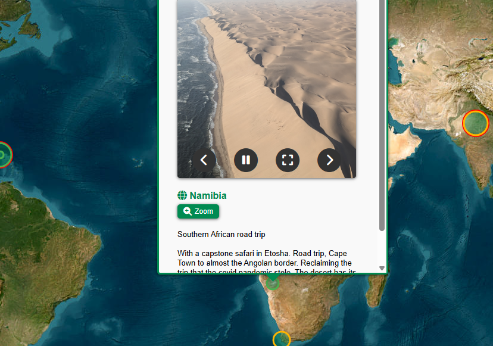

# Waypoints: A GeoBiography
A map of memories, events, and photos in my life

---

## Table of Contents

- [Description](#description)
- [Usage](#usage)
- [Gallery](#gallery)
- [Certificates](#certificates)
- [References](#references)
- [Licenses](#licenses)
- [Acknowledgements](#acknowledgements)
- [Author](#author)

## Description

This started as a place to store photos and, uncharitably, bore interlocuters with them. Charitably, it's a data visualization of life highlights.

To my surprise, this has turned into quite the data gathering and engineering project. I envisioned plunking down a few markers with a pop-up carousel of photos, but the scope creep has begun. Details here:

- [Evolving sketch of project](data_dictionary.md)

## History

Drafted concept. Designed database.

Built map and base layers. 

Added marker and popups overlay. Created Overview data for markers. Pulled from API to csv. Sifted through and added photos. Color-coded and icon-ed markers for life events. Added legend.

Activity overlay. Created location and activity data. Write Activity.location_name and Activity.activity_type, coded to auto-fill (mostly) location.id, lat, lng, activity.id, activity.location_id.

Tested deploying on GitHub Pages. Restructured repo to match '/docs' format. Forcibly removed old static/images.

## Usage

Website is hosted on GitHub Pages [here](https://johbry17.github.io/Waypoints-A-GeoBiography/).

Pan and zoom around the map, like any map inteface. Toggle layers on and off from the Leaflet control panel. Click on markers to open popups for further information and, if applicable, a photo reel.

## Gallery

## References

## Licenses

[Creative Commons Attribution 4.0 International License](http://creativecommons.org/licenses/by/4.0/)

## Acknowledgements

Heartfelt thanks to all of the people who have shared this beautiful world and life with me.

## Author

Bryan Johns

Last updated: <!-- START_DATE -->April 2025<!-- END_DATE -->
