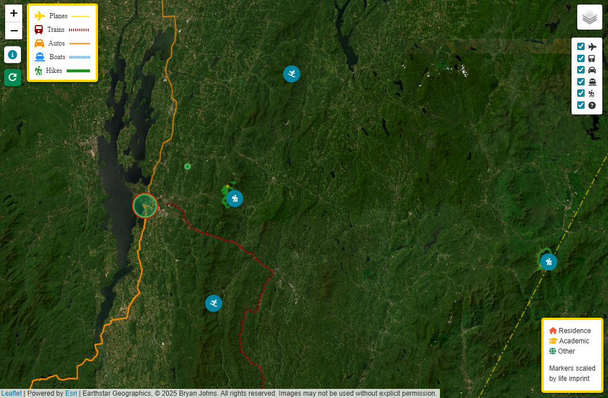

# Waypoints: A GeoBiography

 > **Under Active Development**

A map-based visualization of life’s highlights, combining memories, events, and photos into an interactive experience. Unlike social media, this project is personal, meaningful, and entirely under my control — no algorithms, no ads, just memories. Suck it, social media!

## Table of Contents

- [Description](#description)
- [Usage](#usage)
- [Gallery](#gallery)
- [References](#references)
- [Licenses](#licenses)
- [Acknowledgements](#acknowledgements)
- [Author](#author)

## Description

Waypoints: A GeoBiography started as a simple project to store photos and memories on a map, so I can bore my interlocuters with my vacation photos.

To my surprise, it rapidly evolved into a full-fledged data engineering and visualization project. I envisioned plunking down a few markers with a pop-up carousel of photos, but the scope creep has begun. I never anticipated diving into geospatial routing and visualizing hiking trails with polylines. Evolving sketch of the project [here](data_dictionary.md).

The goal is to create an interactive map that showcases life’s highlights, complete with photos, events, and detailed overlays.

This project uses **Leaflet.js** for map rendering and overlays, and integrates data from various sources, including APIs, CSV files, and custom datasets.

### Features

- **Interactive Map**: Pan, zoom, and explore a map with custom markers and overlays.
- **Photo Popups**: Click on markers to view a carousel of photos associated with the location.
- **Activity Layers**: Toggle activity-specific layers (e.g., hiking, travel) to explore categorized events.
- **Custom Icons and Legends**: Markers are color-coded and icon-based for easy identification of event types.
- **Data Integration**: Combines data from APIs, CSV files, and custom datasets to populate the map dynamically.
- **Responsive Design**: Works seamlessly across devices and screen sizes.

### History

- **Concept**: Drafted the initial idea and designed the database structure.
- **Map Development**: Built the map with base layers and added marker overlays.
- **Data Integration**: Pulled data from APIs, converted to CSV, and added photos.
- **Customization**: Color-coded and icon-based markers for life events. Added a legend.
- **Activity Layers**: Created location and activity datasets. Automated data filling for markers.
- **Deployment**: Tested and deployed on GitHub Pages. Restructured the repository for `/docs` format.
- **Optimization**: Forcibly removed old `static/images` folder from Git history to reduce repository size.

> - **Current Status**: Integrating polylines for hiking trails and adding a new map layer using data from [Overpass Turbo](https://overpass-turbo.eu/) and [OpenStreetMap](https://www.openstreetmap.org/).

## Usage

The website is hosted on GitHub Pages and can be accessed [here](https://johbry17.github.io/Waypoints-A-GeoBiography/).

### How to Use:
1. **Explore the Map**: Pan and zoom around the map like any standard map interface.
2. **Toggle Layers**: Use the Leaflet control panel to toggle layers (e.g., activities, photos).
3. **View Popups**: Click on markers to open popups with additional information and photo reels.

## Gallery

## References

- [Leaflet.js Documentation](https://leafletjs.com/)
- [Overpass API Documentation](https://wiki.openstreetmap.org/wiki/Overpass_API)
- [Nominatim Documentation](https://nominatim.org/release-docs/latest/)
- [GitHub Pages Documentation](https://docs.github.com/en/pages)
- [MIT License](https://opensource.org/licenses/MIT)

## Licenses

- **Code**: The code in this repository is licensed under the [MIT License](LICENSE).
- **Images**: All images in this repository are protected under copyright law and are not licensed for use. They may not be copied, modified, or distributed without explicit written permission from the owner.  See [images license](LICENSE_IMAGES) for details.

### Disclaimer

Some of the images in this repository may also be hosted on social media platforms such as Instagram or Facebook. While these platforms may have a license to display the images on their services, the images remain the property of Bryan Johns. They are not licensed for use, modification, or redistribution outside of this repository without explicit written permission.

If you appear in any of the photos and would like them removed, please contact me at bryan.johns.official@gmail.com, and I will take them down promptly.

## Acknowledgements

Heartfelt thanks to all the people who have shared this beautiful world and life with me. Special thanks to the developers of open-source tools like Leaflet.js and GitHub Pages, which made this project possible.

## Author

Bryan Johns

Last updated: <!-- START_DATE -->April 2025<!-- END_DATE -->
