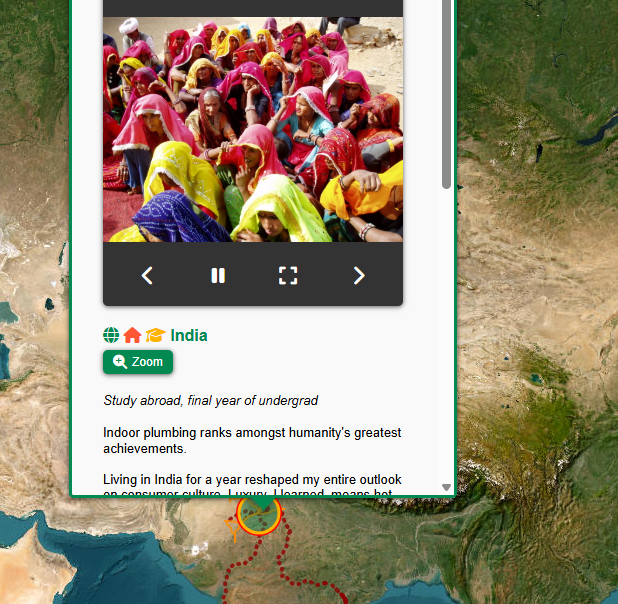

# Waypoints: A GeoBiography
 

 > **Under Active Development**

A map-based visualization of life’s highlights, combining memories, events, and photos into an interactive experience. Unlike social media, this project is personal, meaningful, and entirely under my control — no algorithms, no ads, just memories.

## Table of Contents

- [Description](#description)
- [Features](#features)
- [Technologies Used](#technologies-used)
- [Usage](#usage)
- [Gallery](#gallery)
- [References](#references)
- [Licenses](#licenses)
- [Acknowledgements](#acknowledgements)
- [Author](#author)

## Description

Waypoints: A GeoBiography started as a simple project to store photos and memories on a map, so I can bore others with my vacation photos. It quickly evolved into a full-fledged **data engineering** and **visualization** project. Initially, I envisioned placing a few markers with photo popups, but the project expanded to include geospatial routing, hiking trail visualizations, and dynamic overlays.

Waypoints creates an **interactive map** that showcases life’s highlights, complete with photos, events, and detailed overlays.  This project combines **geospatial tools** with personal storytelling to create a unique and immersive experience.

Technically, Waypoints leverages a suite of geospatial tools:

- **Leaflet.js**: For rendering dynamic, interactive maps with custom markers, clustering, and polylines.
- **Overpass API**: To query OpenStreetMap data for geographic features like hiking trails, ferry routes, and waterways.
- **Nominatim**: For geocoding and reverse geocoding, converting locations into geographic coordinates and vice versa.
- **OpenRouteService API**: For routing and geospatial analysis, including isochrones and multi-modal transportation routes.
- **GeographicLib**: For precise geodesic calculations, such as great circle routes for airplane travel.
- **geojson.io**: Used to manually draw and edit custom boat and ferry routes, and export them as GeoJSON files.
- **GeoJSON**: As the primary format for encoding geographic data structures, enabling seamless integration with mapping libraries.

The backend, powered by **Python**, processes data from multiple sources, including APIs, Google Sheets, and CSV files. Google Sheets serves as a flexible data management layer. Data Dictionary [here](data_dictionary.md). The map includes custom markers, activity layers, and photo popups, creating an intuitive and visually rich user experience.

## Features

- **Interactive Map**: Pan, zoom, and explore a map with custom markers and overlays.
- **Photo Popups**: Click on markers to view a carousel of photos associated with the location.
- **Activity Layers**: Toggle activity-specific layers (e.g., hiking, snorkeling) to explore memorable events and activities.
- **Routes Layers**: Visualize transportation routes, such as hiking trails, ferry routes, and airplane paths, using polylines and geospatial data.
- **Custom Icons and Legends**: Markers are color-coded and icon-based for easy identification of event types.
- **Data Integration**: Combines data from APIs, CSV files, and custom datasets to populate the map dynamically.
- **Responsive Design**: Works seamlessly across devices and screen sizes.

## Technologies Used

- **Frontend**: Leaflet.js, HTML, CSS, JavaScript
- **Backend**: Python
- **Geospatial Tools**: OpenRouteService, Overpass API, Nominatim
- **Data Formats**: GeoJSON, CSV
- **Hosting**: GitHub Pages

 

> **Current Status**: Building out the activity and location overlays, integrating polylines for hiking trails and adding transportation routes using data from [Overpass Turbo](https://overpass-turbo.eu/) and [OpenStreetMap](https://www.openstreetmap.org/).

## Usage

The website is hosted on GitHub Pages and can be accessed [here](https://johbry17.github.io/Waypoints-A-GeoBiography/).

### How to Use:
1. **Explore the Map**: Pan and zoom around the map like any standard map interface.
2. **Toggle Layers**: Use the Leaflet control panel to toggle layers (e.g., activities, photos).
3. **View Popups**: Click on markers to open popups with additional information and photo reels.

To update: See [./resources/extract_data.ipynb](https://github.com/johbry17/Waypoints-A-GeoBiography/blob/main/resources/extract_data.ipynb)

## Gallery

## References

- [Leaflet.js](https://leafletjs.com/)
- [Overpass Turbo](https://overpass-turbo.eu/)
- [Overpass API Documentation](https://wiki.openstreetmap.org/wiki/Overpass_API)
- [Nominatim API Documentation](https://nominatim.org/release-docs/latest/)
- [OpenRouteService API](https://openrouteservice.org/)
- [GeographicLib Documentation](https://geographiclib.sourceforge.io/)
- [geojson.io](https://geojson.io/)
- [GeoJSON Specification](https://geojson.org/)
- [Font Awesome Icons](https://fontawesome.com/)
- [Material Design Icons](https://materialdesignicons.com/)
- [GitHub Pages Documentation](https://docs.github.com/en/pages)
- [MIT License](https://opensource.org/licenses/MIT)

## Licenses

- **Code**: The code in this repository is licensed under the [MIT License](LICENSE).
- **Images**: All images in this repository are protected under copyright law and are not licensed for use. They may not be copied, modified, or distributed without explicit written permission from the owner.  See [images license](LICENSE_IMAGES) for details.

### Disclaimer

Some of the images in this repository may also be hosted on social media platforms such as Instagram or Facebook. While these platforms may have a license to display the images on their services, the images remain the property of Bryan Johns. They are not licensed for use, modification, or redistribution outside of this repository without explicit written permission.

If you appear in any of the photos and would like them removed, please contact me at bryan.johns.official@gmail.com, and I will take them down promptly.

## Acknowledgements

Heartfelt thanks to all the people who have shared this beautiful world and life with me. Special thanks to the developers of open-source tools like Leaflet.js and GitHub Pages, which made this project possible.

## Author

Bryan Johns

Last updated: <!-- START_DATE -->June 2025<!-- END_DATE -->
