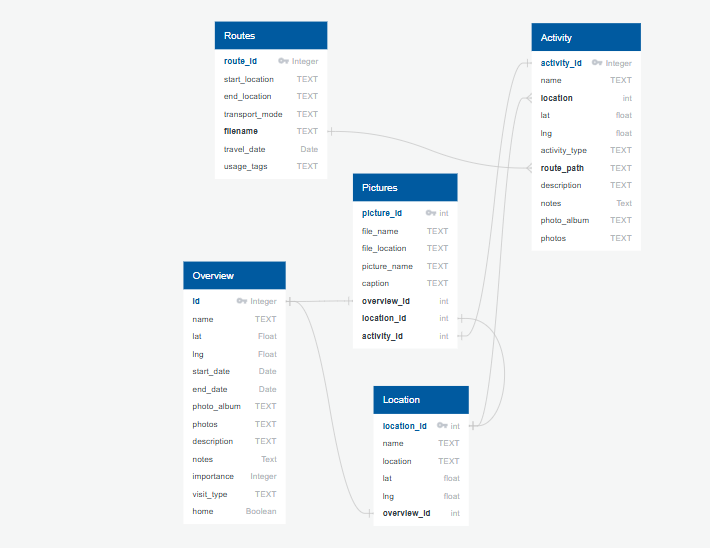

# Data Dictionary: Global Waypoints Project

- [Link to README.md](README.md)

This document defines the structure and purpose of the datasets used in the Global Waypoints project, modeled after a SQL database.

### **Note**
- The data is stored in **Google Sheets**, but exported as JSON and CSV for use in the map.

## **Overview Table**
Stores details about locations visited, including time spent and general descriptions.

| Column Name      | Data Type  | Description |
|-----------------|-----------|-------------|
| `id`           | Integer PK | Unique identifier for each waypoint |
| `name`         | TEXT       | Name of the waypoint or place |
| `lat`          | Float      | Latitude coordinate |
| `lng`          | Float      | Longitude coordinate |
| `start_date`   | Date       | Approximate or exact arrival date |
| `end_date`     | Date       | Approximate or exact departure date |
| `photo_album`  | TEXT       | Link or reference to an associated photo album |
| `photos`       | TEXT       | Links or references to associated photos |
| `description`  | TEXT       | Short summary or story about this location |
| `notes`        | TEXT       | Additional details or memories from the visit |
| `importance`   | Integer    | Scale of location's admittedly subjective importance to biography (1-10) |
| `visit_type`   | TEXT       | Purpose of visit (e.g., home, work, school, friends, family, solo) |
| `home` | Boolean | If I resided there for at least half a year |
| `zoomBounds`   | TEXT       | Bounding box for the location, formatted as `[[southwestLat, southwestLng], [northeastLat, northeastLng]]` (Optional) |
| `zoomLevel` | Integer    | Default zoom level for the map when focusing on this location (Optional) |

 

## **Location Table**
Stores geographic details of visited locations.

| Column Name     | Data Type  | Description |
|----------------|-----------|-------------|
| `location_id`  | Integer PK | Unique identifier for each location |
| `name`         | TEXT       | Name of the location, matches to Activity Table |
| `location` | TEXT | Location, formatted for use in geocoding lat/lng |
| `lat`          | Float      | Latitude coordinate |
| `lng`          | Float      | Longitude coordinate |
| `activity_type`| TEXT       | Type of location (e.g., city, beach, mountain) for icons |
| `description`  | TEXT       | Short summary or story about this location |
| `notes`        | TEXT       | Additional details about the location |
| `photo_album`  | TEXT       | Link or reference to an associated photo album |
| `photos`       | TEXT       | Links or references to associated photos |

 

## **Routes Table**
Stores transportation details between locations.

| Column Name         | Data Type  | Description |
|--------------------|-----------|-------------|
| `route_id`        | Integer PK | Unique identifier for each travel route |
| `start_location` | TEXT | Route start name |
| `end_location` | TEXT | Route end name |
| `transport_mode`   | TEXT       | Mode of travel (e.g., Plane, Train, Car) |
| `filename` | TEXT | Name of geojson file containing route polylines |
<!-- | `travel_date`      | Date       | Approximate or exact date of travel |
| `usage_tags`       | TEXT       | Tags for multiple route usage (e.g., "2017, 2022") | -->

 

## **Activity Table**
Logs special activities like hiking routes, road trips, or unique experiences.

| Column Name     | Data Type  | Description |
|----------------|-----------|-------------|
| `activity_id`  | Integer PK | Unique identifier for each activity |
| `name` | TEXT | Name, matches to Location Table |
| `location`  | Integer FK | Reference to the location where activity took place |
| `lat`          | Float      | Latitude coordinate |
| `lng`          | Float      | Longitude coordinate |
| `activity_type`| TEXT       | Type of activity (e.g., Hiking, Snorkeling) |
| `route_path`   | TEXT       | Polyline or waypoints for mapped activities (Optional) |
| `description`  | TEXT       | Short summary or story about this location |
| `notes`        | TEXT       | Additional details about the activity |
| `photo_album`  | TEXT       | Link or reference to an associated photo album |
| `photos`       | TEXT       | Links or references to associated photos |

 

## **Pictures Table**
Stores image details for locations and events.

| Column Name     | Data Type  | Description |
|----------------|-----------|-------------|
| `picture_id`   | Integer PK | Unique identifier for each picture |
| `file_name`    | TEXT       | Name of the picture file |
| `file_location`| TEXT       | Storage location of the picture |
| `picture_name` | TEXT       | Name or title of the picture |
| `caption`      | TEXT       | Caption or description of the picture |
| `overview_id`  | Integer FK | Links to the `Overview` table |
| `location_id`  | Integer FK | Links to the `Location` table |
| `activity_id`  | Integer FK | Links to the `Activity` table |

<!-- --- -->

<!-- ## **6. Trip Table**

Stores details about multi-location trips.

| Column Name      | Data Type  | Description |
|-----------------|-----------|-------------|
| `trip_id`      | Integer PK | Unique identifier for each trip |
| `trip_name`    | TEXT       | Name of the trip |
| `trip_description` | TEXT   | Brief description of the trip |
| `trip_start_date`  | DateTime | Start date of the trip |
| `trip_end_date`    | DateTime | End date of the trip |
| `overview_id`  | Integer FK | Links to the `Overview` table | -->

<!-- --- -->

<!-- ## **7. TripLocation Table**

Stores relationships between trips and locations.

| Column Name    | Data Type  | Description |
|--------------|-----------|-------------|
| `trip_id`   | Integer FK | Links to the `Trip` table |
| `location_id`| Integer FK | Links to the `Location` table |
| `sequence`  | Integer    | Order of locations in the trip | -->

<!-- --- -->

<!-- ## **8. PictureLocation Table** (&#191;Optional?)

Stores relationships between pictures and locations.

| Column Name    | Data Type  | Description |
|--------------|-----------|-------------|
| `picture_id` | Integer FK | Links to the `Pictures` table |
| `location_id`| Integer FK | Links to the `Location` table | -->

<!-- --- -->

<!-- ## PictureOrder Table (&#191;Optional?)

CREATE TABLE PictureOrder (
    picture_id INTEGER REFERENCES Pictures(picture_id),
    context TEXT CHECK(context IN ('overview', 'location')), -- Defines reel type
    order INTEGER,
    PRIMARY KEY (picture_id, context)
); -->

<!-- ## **Marker Clustering Data**
Helps optimize the map by grouping markers into clusters based on zoom levels.

| Column Name    | Data Type | Description |
|---------------|----------|-------------|
| `cluster_id`  | Integer  | Unique identifier for each cluster |
| `center_lat`  | Float    | Latitude of the cluster center |
| `center_lng`  | Float    | Longitude of the cluster center |
| `waypoint_ids` | String  | List of waypoint `id`s in this cluster | -->

 

## **Potential Future Enhancements**
- Implement a **time slider** for filtering visits by year.  
- Add a **Story Mode**, to animate the journey through time.  
- Store **photo metadata** (e.g., GPS locations, timestamps, steps).  
- Add **Interactive Stats** Countries visited, distance traveled, longest stays
- Create a themed **map style** a la Indiana Jones or minimalist dark mode.
- Integrate **weather data** for specific locations with an API, just because I can.

---

 

This document has been and will be updated as the project evolves.
